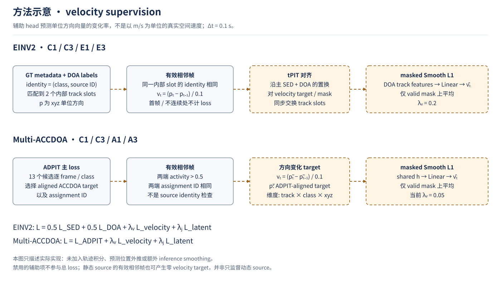
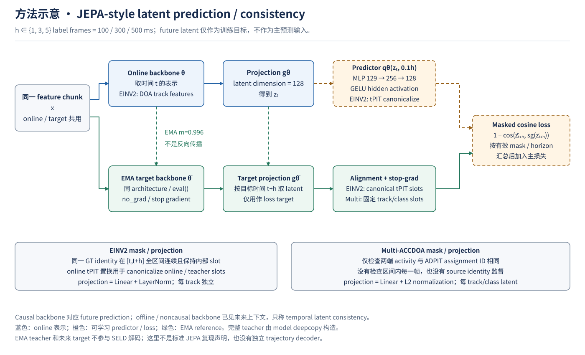
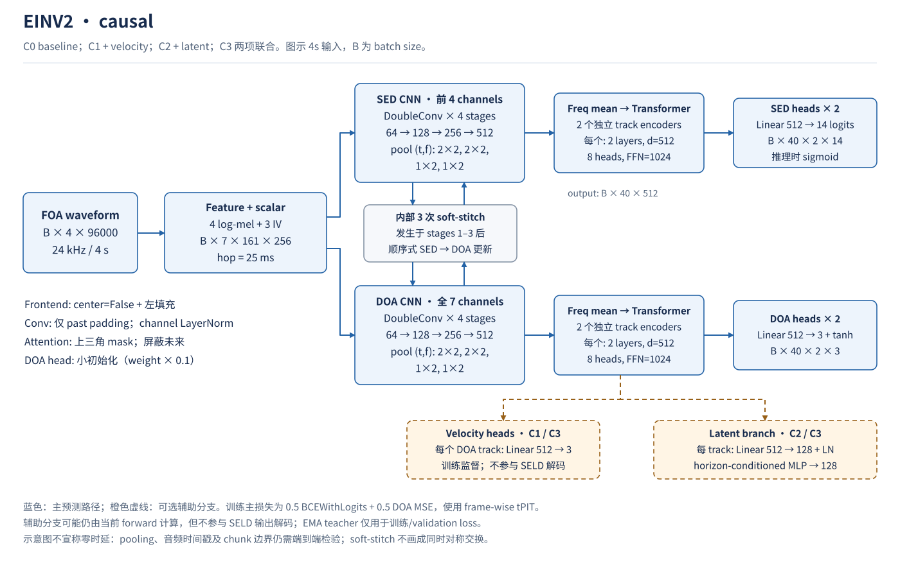
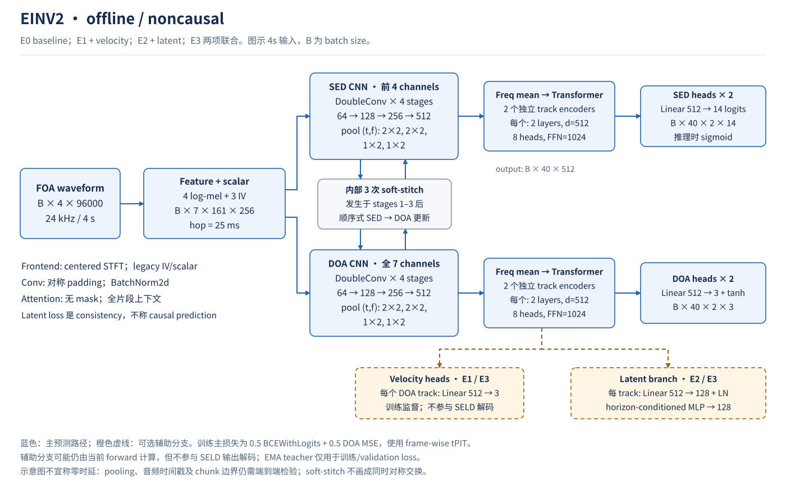
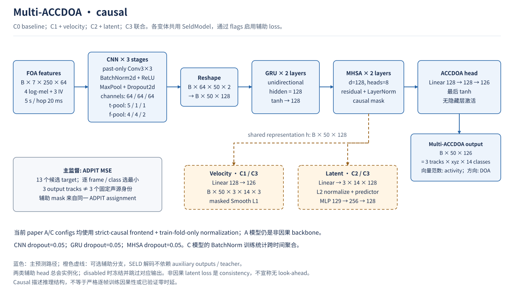
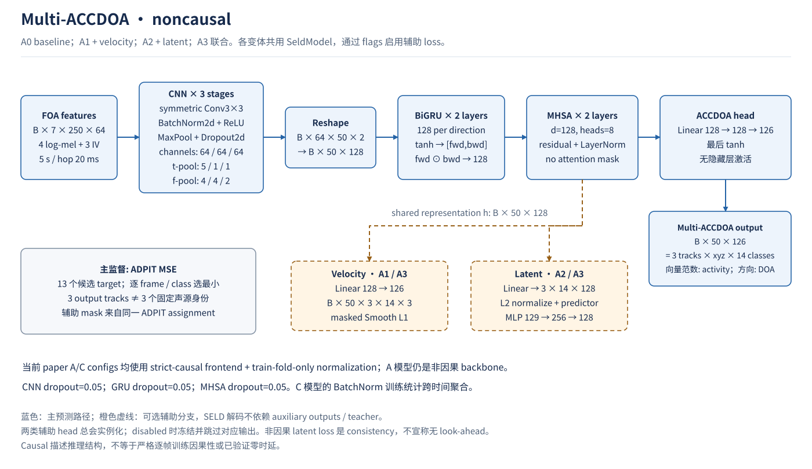

# 方法示意图与模型架构

版本提示：下文与SVG描述0.1.0冻结实现。0.2.0 EINV2采用当前100 ms帧口径，保留75 ms输入依赖，并修正teacher独立轨道对齐等问题，见[重跑协议](EINV2_AUDITED_RUNS.md)。图中的causal不代表相对帧起点零前视；历史实现与结果不覆盖。

依据本仓库 v0.1.0 实际代码与配置绘制，2026-09-04 对照 rabbit02 源文件核查。**图描述实现，不证明方法有效；结果见 [实验总表](../reports/EXPERIMENT_CATALOG.md)。** 六张图均为可编辑 SVG，GitHub 可直接显示；生成源代码一并版本管理。

## 图目录

| 图 | 覆盖模型 / 方法 | 关键区别 |
|---|---|---|
| [Velocity supervision](figures/velocity_supervision.svg) | 两个模型家族的 velocity 辅助监督 | source identity mask 与 ADPIT assignment mask 不同 |
| [Latent prediction / consistency](figures/latent_prediction.svg) | JEPA-style EMA teacher、horizon predictor、mask | causal future prediction 与 full-context consistency 分开描述 |
| [EINV2 causal](figures/einv2_causal.svg) | C0 / C1 / C2 / C3 | 左填充 Conv、channel LayerNorm、masked Transformer |
| [EINV2 offline](figures/einv2_offline.svg) | E0 / E1 / E2 / E3 | 对称 Conv、BatchNorm、unmasked Transformer |
| [Multi-ACCDOA causal](figures/multi_accdoa_causal.svg) | C0 / C1 / C2 / C3 | 左填充 Conv、单向 GRU、masked MHSA |
| [Multi-ACCDOA noncausal](figures/multi_accdoa_noncausal.svg) | A0 / A1 / A2 / A3 | 对称 Conv、BiGRU 逐元素乘积、unmasked MHSA |

蓝色为主预测路径；橙色虚线为可选辅助分支；绿色为 EMA target。EMA teacher 是 online model 的副本，以指数移动平均更新，禁止 target 梯度回传。B 为 batch size；EINV2 示例为 4s，Multi 为 5s。

## 1. Velocity supervision

预测方向变化率 `v_t = (p_t − p_(t−1)) / 0.1s`，`p` 为 Cartesian 单位方向；**不是物理速度 m/s**。主网络增加线性 velocity head，用 masked Smooth L1 辅助监督。没有 trajectory decoder、速度积分、未来位置输出或 inference smoothing。

| Family | target / assignment | 有效 mask |
|---|---|---|
| EINV2 | CSV 的 `(class, source ID)` 匹配到内部 DOA slots；tPIT 按 SED+DOA 的两种置换选择，并同步重排 velocity target/mask | 相邻两帧处于同一内部 slot 且 identity 相同；首帧无效 |
| Multi-ACCDOA | ADPIT 每个 frame/class 从 13 个候选中选取 aligned target，再做一阶差分 | 两端 activity 均有效且 assignment ID 相同；不保证真实声源身份相同 |

静态声源也可贡献有效的零 velocity target。启用 velocity 不等于只对 dynamic subset 优化。

## 2. JEPA-style latent prediction / consistency

`z_t` 经 horizon-conditioned MLP 预测 EMA target 在 `t+h` 的 latent。`h=[1,3,5]` label frames，即 100/300/500ms；latent 128，predictor `129→256→128`、GELU，EMA momentum .996。loss 为 masked cosine distance；没有显式 variance/covariance penalty，latent 统计是监测量而非额外 loss。

| Family | projection / latent 粒度 | 对齐与 mask | 无效 horizon |
|---|---|---|---|
| EINV2 | 每个 DOA track 的 `512→128 + LayerNorm`；2 tracks | online tPIT 的逐帧置换 canonicalize online prediction 和 teacher latent；GT identity 在 `[t,t+h]` 每帧保持同一内部 slot | 无有效项则记 0，最后对 3 个 horizon 平均 |
| Multi-ACCDOA | shared `128→3×14×128`，L2 normalize；track/class latent | 只检查区间两端 activity、ADPIT assignment ID；不检查中间各帧连续性 | 跳过无有效项的 horizon，对其余 horizon 平均 |

EINV2 target 重排复用 **online** tPIT，不是独立做 teacher tPIT。Multi assignment 稳定不能自动等同 source identity 连续，两种 mask 不能画成相同的“object continuity”。

causal 版本以未来 latent 为训练目标；offline/noncausal 当前表示已使用片段未来上下文，故称 **temporal latent consistency**。未来目标和标签 mask 可在训练时使用，但不进入 SELD 预测输入。现有实现是 JEPA-style 辅助正则，不声称完整复现某个标准 JEPA 模型。

## 3. EINV2 架构

### Causal

### Offline / noncausal

每分支 4 个 DoubleConv stages；每个 DoubleConv 有两层 `3×3 Conv → Norm → ReLU`。SED 看前 4 个 log-mel channels，DOA 看全部 7 channels。前三个 stages 后有 soft-stitch；实际为**顺序式**更新：`SED' = a·SED + b·DOA`，`DOA' = c·SED' + d·DOA`，不是同时计算的对称交换。

频率平均后，SED/DOA 各有两个独立 track Transformer，每个 2 layers、d=512、8 heads、FFN=1024、dropout=.2。位置编码关闭。SED 输出 logits，训练使用 BCEWithLogits，推理再 sigmoid；DOA head 使用 tanh。总损失：`0.5 L_SED + 0.5 L_DOA + λv L_velocity + λj L_latent`。

| Config | 实际 model identifier | Velocity λ | Latent λ | 图中模块 |
|---|---|---:|---:|---|
| [C0](../configs/einv2/C0.yaml) | `CausalEINV2`，位于 C0 | 0 | 0 | causal |
| [C1](../configs/einv2/C1.yaml) | `CausalEINV2`，位于 C1；同名类含 velocity head | .2 | 0 | causal + V |
| [C2](../configs/einv2/C2.yaml) | `CausalEINV2JEPA` | 0 | .2 | causal + L |
| [C3](../configs/einv2/C3.yaml) | `CausalEINV2VelocityJEPA` | .2 | .2 | causal + V + L |
| [E0](../configs/einv2/E0.yaml) | `EINV2`，复用 C0 目录的 `seld.py` | 0 | 0 | offline |
| [E1](../configs/einv2/E1.yaml) | `OfflineEINV2Velocity` | .2 | 0 | offline + V |
| [E2](../configs/einv2/E2.yaml) | `OfflineEINV2JEPAConsistency` | 0 | .2 | offline + L |
| [E3](../configs/einv2/E3.yaml) | `OfflineEINV2VelocityJEPAConsistency` | .2 | .2 | offline + V + L |

`C0_legacy` 为历史归档，不是新 baseline。不同变体保留独立实现；类名相同不代表代码相同。Causal DOA head 小初始化、IV 重排和匹配 scalar 是现有协议的一部分，不能只比较是否加 mask。[预处理/协议细节](EXPERIMENT_PROTOCOL.md)。

## 4. Multi-ACCDOA 架构

### Causal

### Noncausal

CNN 后频率为 2 bins，reshape 到 128 维；GRU 为 2 layers、每向 128。非因果版先对 BiGRU 输出 tanh，再将前后向逐元素相乘为 128 维。两层 MHSA 各为 8 heads、residual + LayerNorm。主 head 的两个 Linear 之间**没有隐藏激活函数**，最后 tanh 输出 `3 tracks × xyz × 14 classes = 126` 维。主损失为 ADPIT MSE；没有独立 SED classifier head。

全部变体使用 `SeldModel`，由 `experiment_matrix.py` 与 portable config 启用辅助项。辅助 head 总会实例化；未启用时冻结，正常 forward 跳过相应输出。当前 recipes 的非零 λ 为 .05，不是 `parameters.py` 中的历史默认 .2。

| Config | causal | Velocity λ | Latent λ | 图中模块 |
|---|---:|---:|---:|---|
| [C0](../configs/multi_accdoa/C0.json) | true | 0 | 0 | causal |
| [C1](../configs/multi_accdoa/C1.json) | true | .05 | 0 | causal + V |
| [C2](../configs/multi_accdoa/C2.json) | true | 0 | .05 | causal + L |
| [C3](../configs/multi_accdoa/C3.json) | true | .05 | .05 | causal + V + L |
| [A0](../configs/multi_accdoa/A0.json) | false | 0 | 0 | noncausal |
| [A1](../configs/multi_accdoa/A1.json) | false | .05 | 0 | noncausal + V；主矩阵暂无结果 |
| [A2](../configs/multi_accdoa/A2.json) | false | 0 | .05 | noncausal + L；主矩阵暂无结果 |
| [A3](../configs/multi_accdoa/A3.json) | false | .05 | .05 | noncausal + V + L |

## 5. 训练 / 推理边界

- EMA teacher、未来 latent target、GT velocity/continuity mask 仅用于训练或 validation loss；SELD 解码不依赖它们。某些 forward 仍计算 auxiliary outputs，**不能据图声称已经剔除其推理计算量**。
- Multi causal CNN 保留 BatchNorm2d，训练统计跨时间/频率聚合；eval 用 running statistics，不等于严格逐帧训练因果性。EINV2 causal 使用逐 time/frequency 位置的 channel LayerNorm。
- “causal”是网络连接/推理结构说明，不是已测得零 latency。时间 pooling、STFT 时间戳、chunk 边界和状态重置仍影响端到端行为；图不替代 streaming latency / causality 测试。
- Multi A/C 当前均用 strict-causal frontend 与 train-fold-only normalization；A backbone 仍看完整片段。EINV2 offline 保留 centered frontend / legacy IV/scalar，两个模型家族的预处理并不完全一致。

## Evidence Index 与维护

| 图中内容 | 代码证据 |
|---|---|
| EINV2 causal backbone / heads | [C3 seld_causal.py](../models/einv2/variants/C3/seld/methods/ein_seld/models/seld_causal.py)；C0/C1/C2 在对应 variant 同路径 |
| EINV2 offline baseline | [C0 seld.py](../models/einv2/variants/C0/seld/methods/ein_seld/models/seld.py) |
| Offline velocity | [E1 seld_offline_aux.py](../models/einv2/variants/E1/seld/methods/ein_seld/models/seld_offline_aux.py) |
| Offline latent / combined | [E2 seld_offline_jepa.py](../models/einv2/variants/E2/seld/methods/ein_seld/models/seld_offline_jepa.py)、[E3 seld_offline_combined.py](../models/einv2/variants/E3/seld/methods/ein_seld/models/seld_offline_combined.py) |
| tPIT / auxiliary losses | [C3 losses.py](../models/einv2/variants/C3/seld/methods/ein_seld/losses.py) |
| Velocity / identity masks | [build_velocity_labels.py](../models/einv2/variants/C1/tools/build_velocity_labels.py)、[build_jepa_masks.py](../models/einv2/variants/C2/tools/build_jepa_masks.py) |
| EINV2 EMA teacher / causal frontend | [C3 training.py](../models/einv2/variants/C3/seld/methods/ein_seld/training.py)、[feature_causal.py](../models/einv2/variants/C0/seld/methods/feature_causal.py) |
| Multi backbone / ADPIT / masks | [seldnet_model.py](../models/multi_accdoa/seldnet_model.py) |
| Multi EMA / params / flags | [train_seldnet.py](../models/multi_accdoa/train_seldnet.py)、[parameters.py](../models/multi_accdoa/parameters.py)、[experiment_matrix.py](../models/multi_accdoa/experiment_matrix.py) |
| 原服务器路径 / hash / 差异 | [source audit](../reports/catalog_20260904/source_audit.json)、[已登记迁移改动](../provenance/relocation_changes.json) |
| SVG 生成与布局检查 | [build_architecture_figures.py](../scripts/figures/build_architecture_figures.py)、[check_svg_layout.cjs](../scripts/figures/check_svg_layout.cjs) |

重新生成：`python scripts/figures/build_architecture_figures.py`。修改模型后须同步更新图和说明；本次未修改模型、训练脚本、loss 或实验配置。
